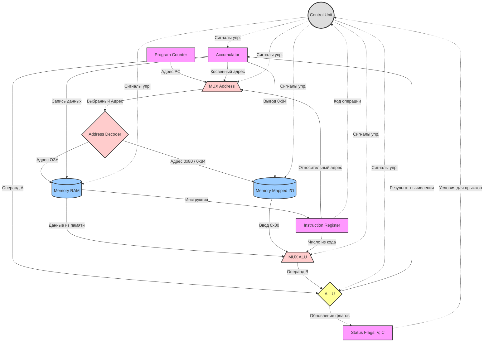

```mermaid
graph TD
    %% Настройки стилей
    classDef reg fill:#f9f,stroke:#333,stroke-width:2px;
    classDef alu fill:#ff9,stroke:#333,stroke-width:2px;
    classDef mem fill:#9cf,stroke:#333,stroke-width:2px;
    classDef mux fill:#fcc,stroke:#333,stroke-width:2px;
    classDef cu fill:#ddd,stroke:#333,stroke-width:3px;

    %% --- ОБЪЯВЛЕНИЕ БЛОКОВ ПРОЦЕССОРА ---
    CU((Control Unit)):::cu
    FLAGS[Status Flags: V, C]:::reg

    PC[Program Counter]:::reg
    IR[Instruction Register]:::reg
    ACC[Accumulator]:::reg

    ALU{A L U}:::alu
    MUX_ALU[/MUX ALU\]:::mux
    MUX_ADDR[/MUX Address\]:::mux
    ADDR_DEC{Address Decoder}:::mux

    MEM[(Memory RAM)]:::mem
    IO[(Memory Mapped I/O)]:::mem

    %% --- ЛИНИИ ДАННЫХ (Сплошные стрелки) ---
    
    %% Формирование адреса
    PC -->|Адрес PC| MUX_ADDR
    IR -->|Относительный адрес| MUX_ADDR
    ACC -->|Косвенный адрес| MUX_ADDR
    
    MUX_ADDR -->|Выбранный Адрес| ADDR_DEC
    ADDR_DEC -->|Адрес ОЗУ| MEM
    ADDR_DEC -->|Адрес 0x80 / 0x84| IO

    %% Чтение данных
    MEM -->|Инструкция| IR
    MEM -->|Данные из памяти| MUX_ALU
    IO -->|Ввод 0x80| MUX_ALU
    IR -->|Число из кода| MUX_ALU

    %% Вычисления
    ACC -->|Операнд A| ALU
    MUX_ALU -->|Операнд B| ALU
    ALU -->|Результат вычисления| ACC
    
    %% Запись данных
    ACC -->|Запись данных| MEM
    ACC -->|Вывод 0x84| IO

    %% --- ЛИНИИ УПРАВЛЕНИЯ (Пунктирные стрелки) ---
    ALU -.->|Обновление флагов| FLAGS
    FLAGS -.->|Условия для прыжков| CU
    IR -.->|Код операции| CU

    CU -.->|Сигналы упр.| ACC
    CU -.->|Сигналы упр.| MEM
    CU -.->|Сигналы упр.| IO
    CU -.->|Сигналы упр.| ALU
    CU -.->|Сигналы упр.| MUX_ALU
    CU -.->|Сигналы упр.| MUX_ADDR
```
